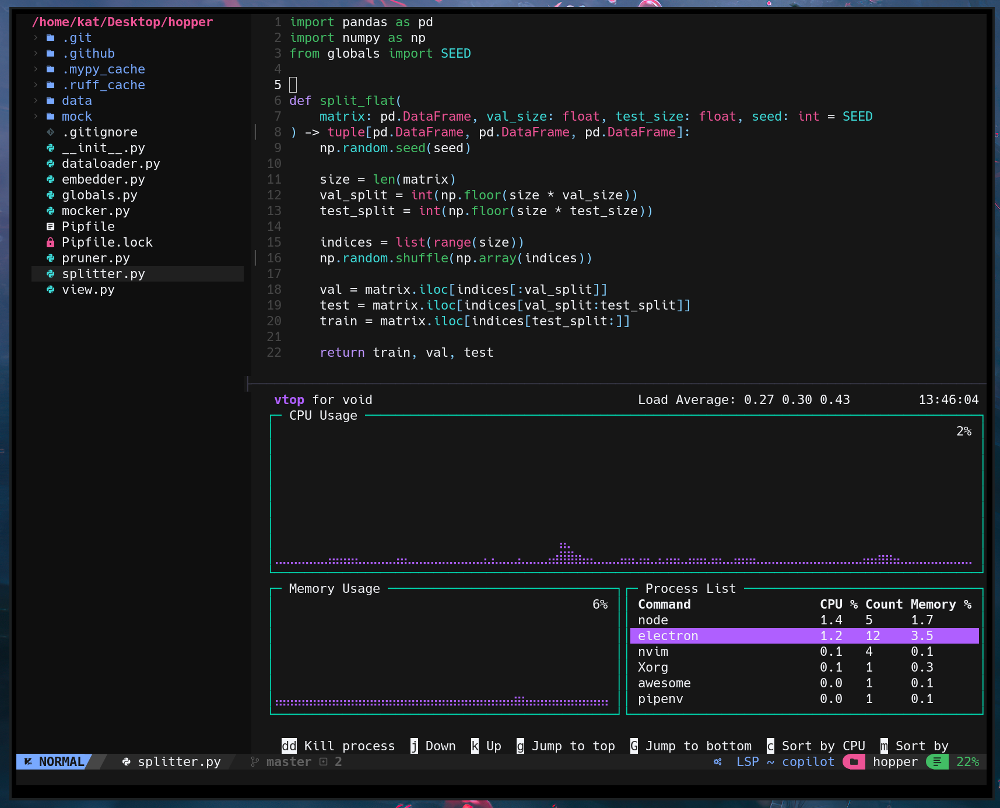

# Core Components
- Bootstrapped from [NvChad](https://github.com/nvchad/nvchad):
    - [Telescope](https://github.com/nvim-telescope/telescope.nvim)
    - [NvimTree](https://github.com/nvim-tree/nvim-tree.lua)
    - [Lazy](https://github.com/folke/lazy.nvim)
    - [TreeSitter](https://github.com/nvim-treesitter/nvim-treesitter)
    - etc ...
- Custom dashboard using [dashboard.nvim](https://github.com/nvimdev/dashboard-nvim).

### Dashboard

##### Surprise!
The dashboard has a surprise in there, but I'm going to spoil it anyway:

> The `p` key maps to `Telescope planets`. 

Of course, there a more useful hotkeys in the dashboard as well. `u` for updating packages with [Lazy](https://github.com/folke/lazy.nvim), `ff` for `Telescope find_files`, and `mg` for `Telescope live_grep`.

### _oxocarbon_
Wouldn't be complete without [nyoom-engineering](https://github.com/nyoom-engineering)'s [oxocarbon](https://github.com/nyoom-engineering/oxocarbon.nvim) theme:
