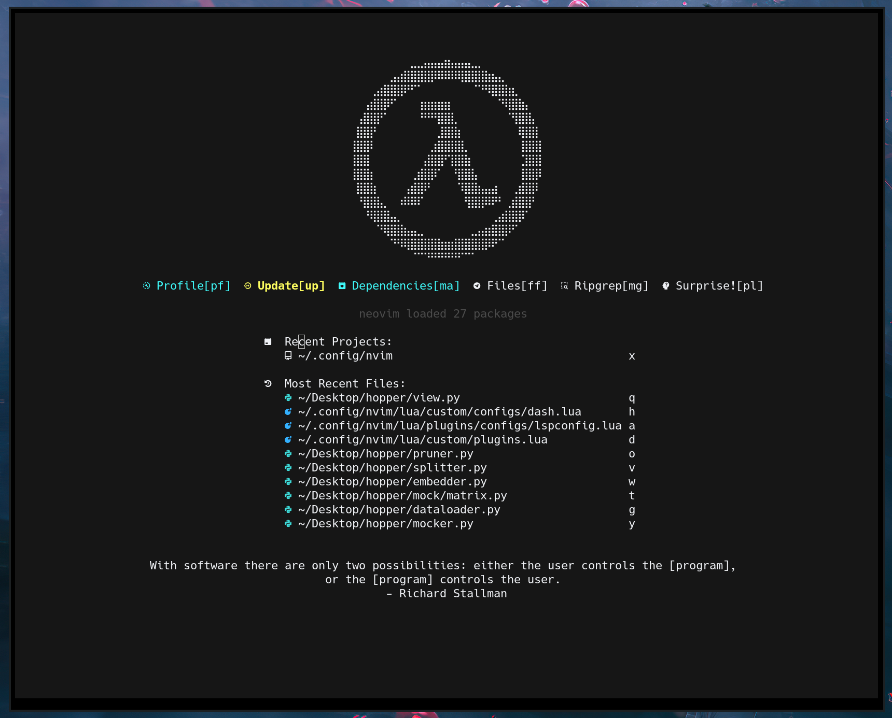
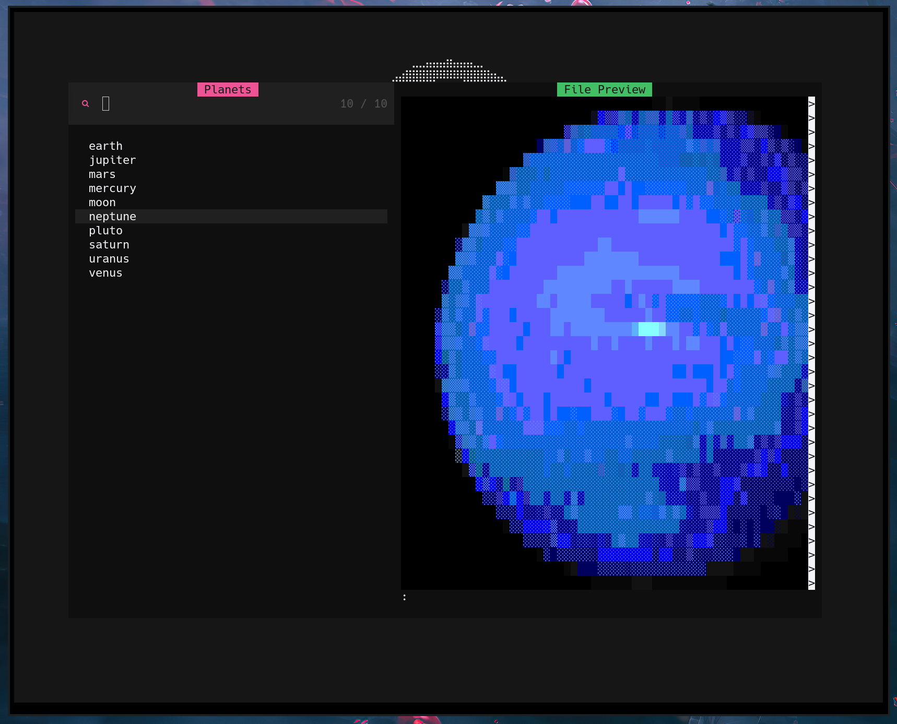

# Core Components
- Bootstrapped from [NvChad](https://github.com/nvchad/nvchad), so we get pre-configured plugins like:
    - [Telescope](https://github.com/nvim-telescope/telescope.nvim)
    - [NvimTree](https://github.com/nvim-tree/nvim-tree.lua)
    - [Lazy](https://github.com/folke/lazy.nvim)
    - [TreeSitter](https://github.com/nvim-treesitter/nvim-treesitter)
    - [NvTerm](https://github.com/NvChad/nvterm)
- Additional features include:
    - Custom dashboard using [dashboard.nvim](https://github.com/nvimdev/dashboard-nvim).
    - Pre-configured LSPs for _Rust_, _Python_ and _TypeScript_.
    - [copilot.vim](https://github.com/github/copilot.vim) installed _by default_.

### _oxocarbon_
[nyoom-engineering](https://github.com/nyoom-engineering)'s [oxocarbon](https://github.com/nyoom-engineering/oxocarbon.nvim) theme:

> [NvChad](https://github.com/nvchad/nvchad)'s Terminal-integration with [NvTerm](https://github.com/NvChad/nvterm).

### Dashboard
Overides _NvChad_'s start screen with a more powerful interface using [dashboard.nvim](https://github.com/nvimdev/dashboard-nvim).

##### Surprise!
The dashboard has a surprise in there, but I'm going to spoil it anyway:

> The `pl` key maps to `Telescope planets`. 

Of course, there a more useful hotkeys in the dashboard as well.
- `pf` for inspecting `Lazy profile`
- `up` for updating packages with [Lazy](https://github.com/folke/lazy.nvim),
- `ma` for viewing `Mason` dependencies,
- `ff` for `Telescope find_files`,
- `mg` for `Telescope live_grep`.

> Using `mg` from the dashboard.

### Pre-configured LSPs
For the following languages,
- _Rust_
- _Python_
- _TypeScript_

